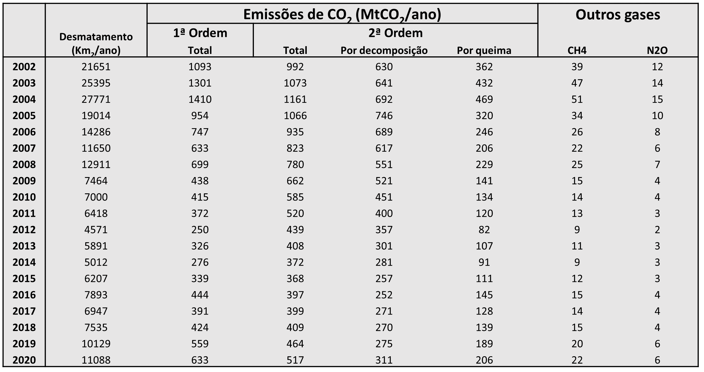

# Análise de Desmatamento e Emissões de Carbono na Amazônia

  <a href="README.md">🇺🇸 English</a> •
  🇧🇷 Português

---
Este projeto analisa as emissões de carbono associadas ao desmatamento por corte raso na Amazônia Brasileira, com base em dados do PRODES (INPE).

O foco está na compreensão da evolução das emissões ao longo do tempo e seu impacto no ciclo de carbono.

## 📊 Tipos de Emissões

### 🔹 Emissões de 1ª Ordem
- Consideram que todo o carbono da vegetação é liberado imediatamente no ano do desmatamento  
- Refletem diretamente as variações anuais  
- Maior sensibilidade a picos e quedas  

### 🔹 Emissões de 2ª Ordem
- Consideram a liberação gradual do carbono ao longo do tempo  
- Incorporam processos como decomposição da biomassa  
- Representação mais estável e realista da dinâmica do carbono  

## 📥 Fonte dos Dados
- PRODES / INPE  

## 🛠️ Tecnologias Utilizadas
- Python  
- Pandas  
- Matplotlib / Seaborn  

## 📈 Análises Realizadas

- Evolução do desmatamento ao longo do tempo  
- Evolução das emissões de carbono  
- Comparação entre cenários com e sem degradação  
- Relação entre desmatamento e emissões de carbono  
- Análise de escala e unidades (km² vs hectares)  

## Análise do Desmatamento e Emissões na Amazônia (1960–2020)

  

